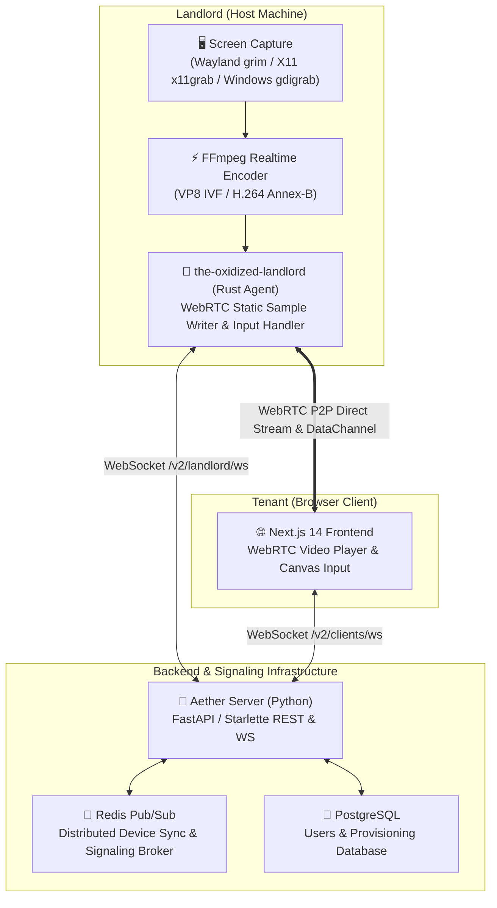

<div align="center">

# 🌐 Aether

### High-Performance P2P Remote Desktop & Compute Sharing Platform

[](https://nextjs.org/)
[](https://www.rust-lang.org/)
[](https://www.python.org/)
[](https://webrtc.org/)
[](https://redis.io/)
[](https://www.docker.com/)

</div>

---

## 📖 Overview

**Aether** is a modern, low-latency, peer-to-peer (P2P) remote desktop streaming and compute-sharing platform. It allows **Landlords** (hosts) to share their physical screen and computing power directly with **Tenants** (clients) over ultra-low-latency WebRTC streams.

Tenants can connect through any standard web browser, watch real-time full-motion desktop video, and interact seamlessly via remote mouse pointer clicks and control events without installing third-party browser plugins.

---

## 🏗️ Architecture



### Core Components

1. **Rust Host Agent (`the-oxidized-landlord`)**:
   - Captures the screen natively on **Linux Wayland** (via `grim`), **Linux X11** (via `x11grab`), and **Windows** (via `gdigrab`).
   - Encodes frames using real-time **VP8 IVF** (or H.264) with dynamic 90 kHz RTP packetization.
   - Handles interactive remote mouse inputs (Hyprland `hyprctl`, `xdotool`, and `mouse_rs`).

2. **Signaling & State Broker (`server`)**:
   - Python backend managing authentication, Landlord identification tokens, and device registration.
   - **Redis Pub/Sub Signaling (`/v2/`)** for fast WebRTC SDP Offer/Answer exchanges and ICE routing.
   - PostgreSQL database for persistent user records and credentials.

3. **Client Web Application (`frontend`)**:
   - Next.js 14 web application featuring NextAuth authentication (GitHub OAuth & Credentials).
   - Live interactive WebRTC remote desktop canvas with automatic aspect ratio scaling, fullscreen support, and mouse control channels.

---

## 🚀 Quickstart with Docker Compose

The fastest way to launch the entire Aether backend infrastructure, PostgreSQL database, Redis signaling broker, and Next.js frontend is using Docker Compose.

### 1. Clone & Configure Environment

```bash
git clone https://github.com/your-username/aether.git
cd aether

# Copy environment template
cp .env.example .env
```

Ensure your `.env` file has valid values:

```env
# PostgreSQL Configuration
POSTGRES_DB=aether
POSTGRES_USER=root
POSTGRES_PASSWORD=secret
POSTGRES_PORT=5432

# Redis Configuration
REDIS_PORT=6379

# Python Backend Server
USE_DATABASE=1
USE_REDIS=1
JWT_SECRET=super_secret_jwt_key_change_me
JWT_EXPIRY=120

# GitHub OAuth (Optional: create at https://github.com/settings/developers)
GITHUB_CLIENT_ID=your_github_client_id
GITHUB_CLIENT_SECRET=your_github_client_secret

# Frontend Configuration
FRONTEND_PORT=3000
NEXTAUTH_URL=http://localhost:3000
NEXTAUTH_SECRET=super_secret_jwt_key_change_me
```

### 2. Start Services with Docker

```bash
docker compose up --build -d
```

### 3. Verify Running Services

Check the container status:

```bash
docker compose ps
```

| Service         | Port                    | Description                    |
| :-------------- | :---------------------- | :----------------------------- |
| **Frontend**    | `http://localhost:3000` | Next.js Web Interface          |
| **Backend API** | `http://localhost:7878` | Python REST & WebSocket Server |
| **Redis**       | `localhost:6379`        | Pub/Sub Signaling Broker       |
| **PostgreSQL**  | `localhost:5432`        | User & Landlord Database       |

---

## 🖥️ Running the Landlord (Host Screen Sharer)

The Landlord agent runs natively on the machine whose screen and resources you wish to stream.

### Prerequisites

- **Rust & Cargo** (1.75+): `curl --proto '=https' --tlsv1.2 -sSf https://sh.rustup.rs | sh`
- **FFmpeg**: Must be installed and available in `$PATH` (`sudo pacman -S ffmpeg` or `sudo apt install ffmpeg`).
- **Linux Wayland Users (Hyprland / Sway)**: Install `grim` for native Wayland capture (`sudo pacman -S grim` or `sudo apt install grim`).

### Steps to Stream

1. **Log in / Register**:
   - Open **[http://localhost:3000/login](http://localhost:3000/login)** (or sign in with GitHub).
   - Navigate to **[http://localhost:3000/lobby](http://localhost:3000/lobby)** $\rightarrow$ Click **"Be a Landlord"**.
   - Enter port `8000` and submit to obtain your Landlord credentials.

2. **Launch the Host Agent**:

   ```bash
   cd the-oxidized-landlord
   cargo run
   ```

3. **Connect from Tenant Dashboard**:
   - Navigate to **[http://localhost:3000/dashboard](http://localhost:3000/dashboard)**.
   - Your device will appear in the live devices list.
   - Click **"Connect & Stream Now"** to start real-time remote desktop control!

---

## 🛠️ Manual / Local Development Setup

If you prefer running services locally without Docker:

### 1. Start Redis and PostgreSQL

```bash
# Using Docker for dependencies only:
docker run -d --name aether-redis -p 6379:6379 redis:7-alpine
docker run -d --name aether-postgres -p 5432:5432 -e POSTGRES_DB=aether -e POSTGRES_USER=root -e POSTGRES_PASSWORD=secret postgres:14-alpine
```

### 2. Run Python Server

```bash
cd server
python3 -m venv venv
source venv/bin/activate
pip install -r requirements.txt

# Run migrations & start server on port 7878
python -m aether_server
```

### 3. Run Next.js Frontend

```bash
cd frontend
npm install
npm run dev
```

---

## 🔐 Environment Variables Reference

| Variable               | Default                 | Description                                       |
| :--------------------- | :---------------------- | :------------------------------------------------ |
| `POSTGRES_DB`          | `aether`                | PostgreSQL database name                          |
| `POSTGRES_USER`        | `root`                  | Database user                                     |
| `POSTGRES_PASSWORD`    | `secret`                | Database password                                 |
| `POSTGRES_PORT`        | `5432`                  | Exposed PostgreSQL host port                      |
| `REDIS_PORT`           | `6379`                  | Exposed Redis broker port                         |
| `USE_DATABASE`         | `1`                     | Enable database persistence in backend            |
| `USE_REDIS`            | `1`                     | Enable Redis Pub/Sub signaling broker             |
| `JWT_SECRET`           | -                       | Secret key used for signing authentication tokens |
| `GITHUB_CLIENT_ID`     | -                       | GitHub OAuth Client ID                            |
| `GITHUB_CLIENT_SECRET` | -                       | GitHub OAuth Client Secret                        |
| `FRONTEND_PORT`        | `3000`                  | Port for the Next.js frontend web app             |
| `NEXTAUTH_URL`         | `http://localhost:3000` | Canonical root URL for NextAuth callbacks         |

---

## 📜 License

Distributed under the MIT License. See `LICENSE` for more information.
